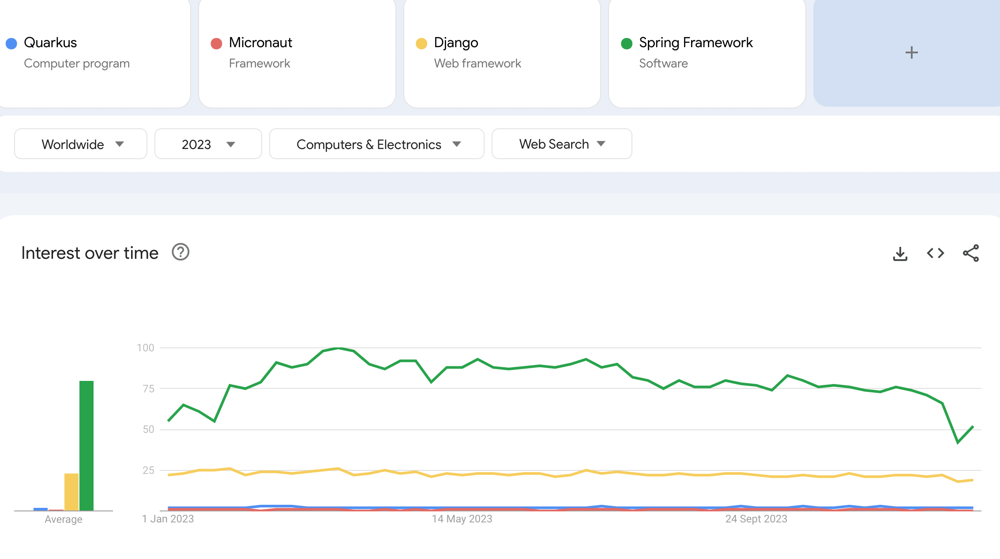
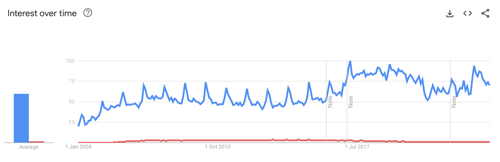

# Understanding the Spring Ecosystem

In this lesson, we'll go through the main modules that Spring offers and understand how they relate to each other to form the Spring ecosystem.

## What is Spring?
Let's start with understanding what Spring actually is. Simply put, Spring is a [back-end](https://en.wikipedia.org/wiki/Front_and_back_ends) technology with a broad range of uses, the most common being the development of web applications.

Spring is also a very general term which can refer to the core of the framework, but most often, it refers to the whole family of Spring-related projects.

## The Popularity of Spring
The framework is also quite dominant in the Java ecosystem.

Let's have a look at just a quick search trend: [Spring Framework Google Search Trend](https://trends.google.com/trends/explore?date=all&q=%2Fm%2F0dhx5b)

And given that Spring was originally built in response to the complexity of developing with [J2EE](https://www.oracle.com/technetwork/java/javaee/appmodel-135059.html) / Java EE, let's compare it with that: [Spring Framework - Java EE Google Search Trend Comparison](https://trends.google.com/trends/explore?date=all&q=%2Fm%2F0dhx5b,Java%20EE)

As the graph shows, Spring clearly overtakes its main competitor in popularity.

Another indication of Spring's popularity is the number of questions on StackOverflow for Spring compared to other related Java technologies:

-   [Spring Questions (148k)](https://stackoverflow.com/questions/tagged/spring)
-   [Hibernate Questions (77k)](https://stackoverflow.com/questions/tagged/hibernate)
-   [Maven Questions (66k)](https://stackoverflow.com/questions/tagged/maven)
-   [Tomcat Questions (37k)](https://stackoverflow.com/questions/tagged/tomcat)
-   [Servlets Questions (31k)](https://stackoverflow.com/questions/tagged/servlets)
-   [Java EE Questions (28k)](https://stackoverflow.com/questions/tagged/java-ee)
-   [Grails Questions (28k)](https://stackoverflow.com/questions/tagged/grails)

## Why Use Spring?
The early goal of Spring, and still a core guideline of the framework, is removing complexity, clutter and boilerplate code. Basically, Spring aims to make building a system easier for developers. This is a monumental task, and one that, solved correctly, can make a huge impact.

Spring is also not an all or nothing choice. You can actually pick and choose the parts of Spring that make sense for your system.

An interesting aspect of Spring is how much of a long-term investment learning Spring actually is, as its evolution is quite unique. On the one hand, it's actively developed and always improving at the edges. But, at the core, it's highly highly stable. In fact, it's so stable that learning the core of Spring 10 years ago would, with small exceptions, still be relevant today.

[This article](https://medium.com/javarevisited/10-reasons-why-it-is-worth-learning-spring-boot-in-2023-fd06bf833de8) underlines the key factors behind Spring relevance:
* Spring Remains Viable, And Its Track Record Of Staying Current And Relevant Is Impressive
* The Ecosystem Integrates With Existing Popular Libraries
* Spring Is Everywhere — Personal Or Corporate
* Spring Boots Testability
* Monitoring And Observability
* Simplicity And Rapid Development
* Microservice Support
* Embedded Servers
* Spring Boot Is Open Source
* Community And Support

## The Spring Ecosystem
Due to the success of the framework, the Spring ecosystem grew over time.

This is now quite vast, as you can see on the [official site](https://spring.io/projects/spring-framework).

**Let's go through some of the most popular Spring modules.**

### Spring Core
-   contains the Core technologies: DI, events, validation, data binding, AOP
-   support for testing
-   support for web
-   support for data access
-   can be used with several other programming languages: Java, Kotlin, Groovy, etc

### Spring MVC
-   the Web MVC module
-   technically part of Spring Core, but worth discussing separately
-   Spring has both Spring MVC (for Servlet-stack web applications) and Spring WebFlux (for reactive-stack applications)

### Spring Persistence
-   also part of Spring Core
-   allows Data Access: transactions, DAO/Repository support, JDBC, ORM, Marshalling XML
-   contains the Spring Data project which reduces boilerplate code related to data access

### Spring Security
-   the most popular security framework when working with Java

### Spring Cloud
-   support for distributed system

### Spring Boot
-   provides an opinionated view of Spring development
-   has a very high adoption rate

### Others Spring Projects
-   Spring Batch
-   Spring Integration
-   Spring HATEOAS
-   Spring REST Docs
-   Spring AMQP
-   Spring Web Flow
-   Spring Web Services

In simple terms, **the framework has first class support for most technologies in the Java ecosystem**.

## Resources
- [Spring Framework Reference](https://docs.spring.io/spring/docs/current/spring-framework-reference/overview.html)
- [The Spring Projects](https://spring.io/projects/spring-framework)
