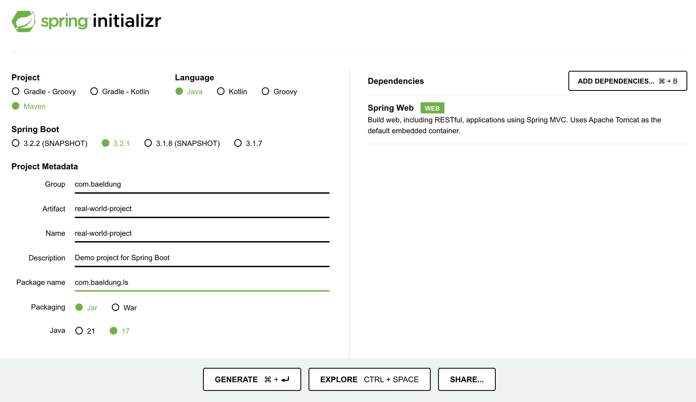

# The Real-World Project We’re Building

In this lesson, we'll get started with the project we'll be using throughout the course.

The relevant module for this lesson is: [real-world-project](../code/learn-spring-m1/real-world-project).

## Creating the Project

Now that we have a broad understanding of Spring, we can start building our project. The example application we've chosen to serve as the code base for the course is **a task management application**.

Let’s start by creating a simple project. **We’ll use the highly useful** [**Spring Initializr**](https://start.spring.io/) **project,**  a quickstart generator for Spring projects.

We'll choose a Maven project using Java, and we need to fill in the project details:

-   Group: com.baeldung
-   Artifact: real-world-project

We can also enter a custom package name.

For the dependencies section, we'll choose the “Spring Web” dependency. Even though we won't be focusing on web aspects in the first modules of the course, we include it at this point since it allows us to start the application and keep it running.



Now we can click the “Generate” button to download the project, unzip it and import it into an IDE.

## Importing the Project in the IDE

For Eclipse, we can click on File > Import > Maven > Existing Maven Projects, “Browse” the directory where we extracted the Maven Project and select “Finish” to import the project:

If you are using IntelliJ, you can import the project by navigating to the main menu, select File > Open, and then navigating to the path where our project is present to add it as a Project.

## Adding the Basic Persistence and Service Layers

We'll create a simple [persistence layer](https://en.wikipedia.org/wiki/Persistence_(computer_science)#Persistence_layers) under the package _com.baeldung.persistence.model_, by adding a _Project_ class.

```
public class Project {
    private Long id;
    private String name;
    private LocalDate dateCreated;

    public Project() {
    }

    public Project(Long id, String name, LocalDate dateCreated) {
        if(Objects.nonNull(id)) {
            this.id = id;
        } else {
            this.id = new Random().nextLong();
        }
        this.name = name;
        this.dateCreated = dateCreated;
    }

    public Project(String name, LocalDate dateCreated) {
        this.id = new Random().nextLong();
        this.name = name;
        this.dateCreated = dateCreated;
    }

    public Project(Project project) {
        this(project.getId(), project.getName(), project.getDateCreated());
    }
    
    // getters, setters, equals, hashCode

}
```
This class will have 3 basic attributes: the _id_, _name_ and _dateCreated_.

Next, we'll add the [repository](https://martinfowler.com/eaaCatalog/repository.html) under the package _com.baeldung.persistence.repository_:

```
public interface IProjectRepository {
    Optional<Project> findById(Long id);
    Collection<Project> findAll();
    Project save(Project project);
}
```

For now, we can simulate persistence for these simple operations, with an in-memory _ArrayList_ under the package _com.baeldung.persistence.repository.impl_:

```
@Repository
public class ProjectRepositoryImpl implements IProjectRepository {

    private final List<Project> projects = new ArrayList<>();

    @Override
    public Optional<Project> findById(Long id) {
        return projects.stream().filter(p -> p.getId().equals(id)).findFirst();
    }

    @Override
    public Collection<Project> findAll() {
        return projects;
    }

    @Override
    public Project save(Project project) {
        Optional<Project> existingProject = findById(project.getId());
        if (existingProject.isPresent()) {
            projects.remove(existingProject);
        }
        Project newProject = new Project(project);
        projects.add(newProject);
        return newProject;
    }
}
```

Moving on to the [service layer](https://en.wikipedia.org/wiki/Multitier_architecture#Common_layers), we'll add a similar service interface under the package _com.baeldung.service_ and class name as _IProjectService_ with an implementation under the package _com.baeldung.service.impl_:

```
public interface IProjectService {
    Optional<Project> findById(Long id);
    Collection<Project> findAll();
    Project save(Project project);
}
```

```
@Service
public class ProjectServiceImpl implements IProjectService {

    @Autowired
    private IProjectRepository projectRepository;

    public ProjectServiceImpl(IProjectRepository projectRepository) {
        this.projectRepository = projectRepository;
    }

    @Override
    public Optional<Project> findById(Long id) {
        return projectRepository.findById(id);
    }

    @Override
    public Collection<Project> findAll() {
        return projectRepository.findAll();
    }

    @Override
    public Project save(Project project) {
        return projectRepository.save(project);
    }
}
```

Here, we’re simply autowiring the Project Repository and implementing the exact same operations and just delegating to the repository.

The _@Repository, @Service_ and _@Autowired_ annotations we've used are Spring annotations that define and connect the 2 classes. We'll go into more details regarding each concept in the next lessons.

## Resources
- [Refactor Operations in Eclipse](https://help.eclipse.org/kepler/index.jsp?topic=%2Forg.eclipse.jdt.doc.user%2Freference%2Fref-menu-refactor.htm)
- [Refactor Operations in IntelliJ](https://www.jetbrains.com/help/idea/refactoring-source-code.html)
