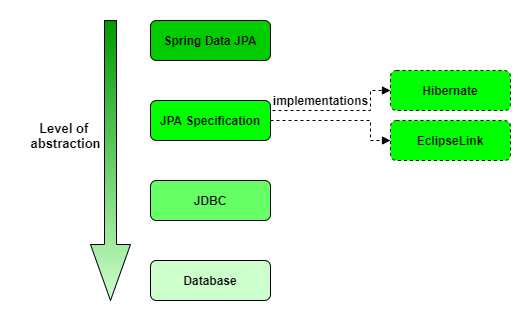
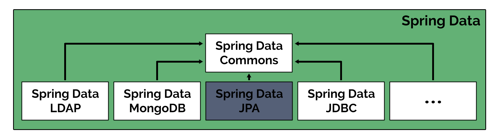

# The Java Persistence Ecosystem

In this lesson, we’ll give an overview of the persistence solutions in Java.

## Java Persistence Solutions

Persistence is an essential part of any system, but can also be tricky to get right. This is why there have been multiple approaches introduced over time, each with its own benefits and drawbacks.

Let’s go over the persistence options available in the Java ecosystem at a very high level. You'll notice that the main aspect that differentiates these options is the level of abstraction over the database. So let’s start with the Java standard that’s closest to accessing the database directly.

**JDBC**

This is the JDBC standard, and it’s also the oldest approach for working with databases in Java.

Using JDBC requires us to use SQL statements, which can be both an advantage and a disadvantage.

The main benefit is having **more control over the SQL that’s executed**, while the main drawback is that it requires more development effort than the next approaches we’ll discuss.

**JPA**

A higher-level alternative to the JDBC standard is the JPA standard (Jakarta Persistence API). This adds an additional layer of abstraction over the database, the basis of which is **the object-relational mapping (ORM) approach**.

With JPA, we create a set of classes (entities) that map to the database tables and then interact with these classes instead of the database tables directly.

We have to keep in mind that JPA is only the specification. The reference implementation of JPA is [EclipseLink](https://projects.eclipse.org/projects/ee4j.eclipselink), but the most popular implementation is the [Hibernate](https://hibernate.org/) ORM (Object Relational Mapping) framework.



With JPA, we’re delegating a lot of functionality to the framework, and whenever that happens, **we lose some control** over what’s finally executed.

If we add to this the fact that the library has to be flexible to adapt to many different scenarios, then we might find that **in some cases, this doesn’t represent the optimal solution from a performance perspective**.

It's worth mentioning that this is a tested and well-designed solution that offers different alternatives to customize the behavior, and overcome most problems we might run into.

The takeaway here is that **this is a very powerful and useful solution**, suitable for most projects, and definitely better than writing a lot of boilerplate manually. There might be edge cases, a few exceptional queries, or persistence procedures where it makes sense to use a different approach. This could mean maybe lower level JPA customizations, or even some JDBC operations, and that’s totally fine.


## Spring Data

**Spring Data is a family of projects, all related to data access aspects**. The goal of this umbrella project is to offer a familiar and consistent Spring-based model for data access, while providing submodules to cover any specific scenario we might have to deal with.

Spring Data Commons is the core subproject. It’s the foundation for all the other modules, which include, among others:

- Spring Data JDBC
- Spring Data LDAP
- Spring Data MongoDB
- Spring Data Redis
- Spring Data JPA



## Spring Data JDBC
Spring Data JDBC is a persistence framework that is not as complex as Spring Data JPA. It doesn’t provide cache, lazy loading, write-behind, or many other features of JPA. Nevertheless, it has its own ORM and provides most of the features we’re used with Spring Data JPA like mapped entities, repositories, query annotations, and JdbcTemplate.

Spring Data JDBC offers a solution that is as simple as using Spring JDBC — there is no magic behind it. Nonetheless, it also offers a majority of features that we’re accustomed to using Spring Data JPA.

One of the biggest advantages of Spring Data JDBC is the improved performance when accessing the database as compared to Spring Data JPA. This is due to Spring Data JDBC communicating directly to the database. Spring Data JDBC doesn’t contain most of the Spring Data magic when querying the database.

One of the biggest disadvantages when using Spring Data JDBC is the dependency on the database vendor. If we decide to change the database from MySQL to Oracle, we might have to deal with problems that arise from databases having different dialects.

## Spring Data JPA

**Spring Data JPA has the particular objective of providing convenient support for JPA-based data access layers.**

This persistence framework offers several useful features, but the most outstanding ones that make it a widely used solution are the possibility of easily implementing JPA-based repositories; reducing the boilerplate of writing, preparing, and executing queries; as well as paginating and auditing.

**We can have fully working data access functionality with only a few lines of code and without having to write a single SQL query.**

Furthermore, with Spring Data JPA, we can create a repository interface that includes different methods that follow a particular naming pattern, and **the framework will build up their implementation automatically for us**:

```
public interface ProjectRepository extends CrudRepository<Project, Long> {

  Iterable<Project> findByNameContaining(String name);

}
```

## Spring Data MongoDB
The **MongoTemplate** follows the standard template pattern in Spring and provides a ready-to-go, basic API to the underlying persistence engine.

The **repository** follows the Spring Data-centric approach and comes with more flexible and complex API operations, based on the well-known access patterns in all Spring Data projects.

## Resources
- [Spring Data Overview](https://spring.io/projects/spring-data)
- [Spring Data JPA Overview](https://spring.io/projects/spring-data-jpa)
- [Introduction to Spring Data JDBC](https://www.baeldung.com/spring-data-jdbc-intro)
- [Introduction to Spring Data MongoDB](https://www.baeldung.com/spring-data-mongodb-tutorial)