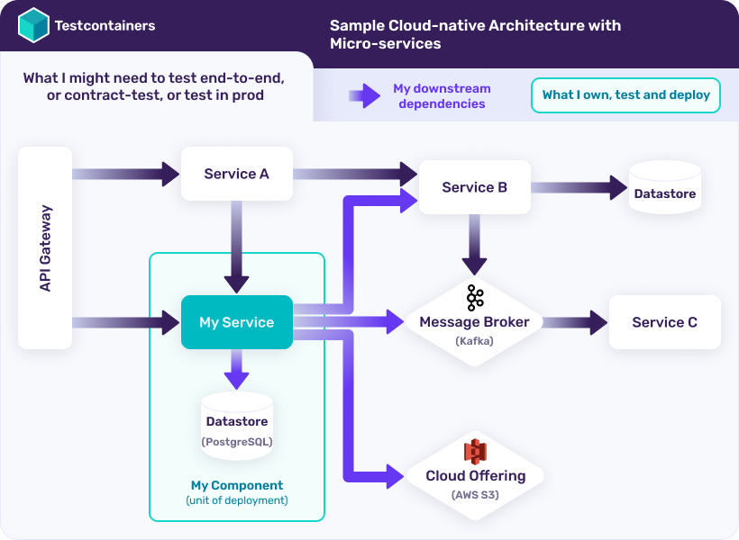
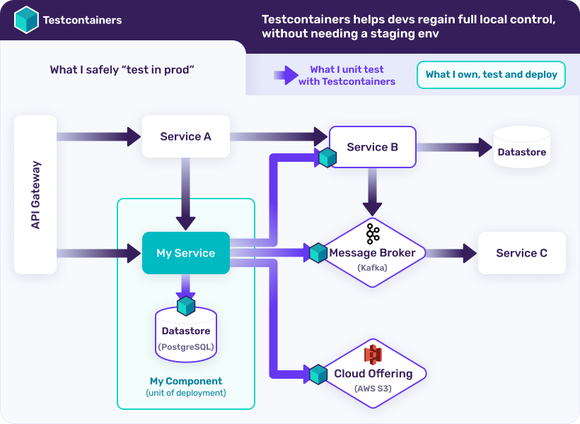

# Testing Spring Data Repositories

In this lesson, we're going to learn how to test Spring Data repositories’ methods using Testcontainers.

The relevant module for this lesson is: [testing-spring-data-repositories-tc-end](../code/learn-spring-m4/testing-spring-data-repositories-tc-end)

## Testing with Testcontainers

_Testcontainers_ is a library that provides easy and lightweight APIs for bootstrapping local development and test dependencies with real services wrapped in Docker containers. Using _Testcontainers_, you can write tests that depend on the same services you use in production without mocks or in-memory services.

**What problems does Testcontainers solve?** Cloud-native infrastructure and microservices have taken control away from developers and made it painful to work locally. Let’s say you’re a developer working on “My Service”, within the following architecture:



While you own only My Service and its datastore (in green), you have several downstream dependencies (in blue) that you need for local development and integration testing. This brings the following challenges:

- Before running tests, you must ensure that the infrastructure is up and running and is pre-configured in a desired state.
- If the resources (database, message broker, etc) are shared across multiple users or CI pipelines, then the test results are non-deterministic because of the possibility of data corruption and configuration drift.

One way to sidestep these challenges is by relying on in-memory databases, embedded services, mocks, and other fake replicas of the production dependencies. However, these approaches bring their own problems (e.g. In-memory services may not have all the features of your production service and behave slightly differently).

_Testcontainers_ solves these problems by running your application dependencies such as databases, message brokers, etc. in Docker containers and helps executing reliable and repeatable tests by talking to those real services and providing a programmatic API for your test code.

In the previous example, you could freely develop and test “My Service” against real dependencies by provisioning them with Testcontainers, directly from your code:



**Differences with Docker and Docker Compose** Docker and Docker Compose can also be used directly for spinning up dependencies that are needed for tests, but this approach has downsides. Creating reliable and fully-initialized service dependencies using raw Docker commands or using Docker Compose requires good knowledge of Docker internals and how to best run specific technologies in a container. For example, creating a dynamic “integration testing environment” by directly using Docker commands or docker-compose may result in port conflicts, containers not being fully initialized or ready for interactions when the tests start, etc. Testcontainers libraries leverage the full power of Docker containers under the hood and expose them to developers via idiomatic APIs.

## Maven dependencies

You can create a new Spring Boot project from Spring Initializr by selecting the Spring Web, Spring Data JPA, PostgreSQL Driver and Testcontainers starters.

If you have selected the Maven build tool you can see that the following Spring Boot starters as well as the Testcontainers Postgres module dependencies are added to the pom.xml.

```
...
<dependency>
    <groupId>org.postgresql</groupId>
    <artifactId>postgresql</artifactId>
    <scope>runtime</scope>
</dependency>
<dependency>
    <groupId>org.springframework.boot</groupId>
    <artifactId>spring-boot-starter-test</artifactId>
    <scope>test</scope>
</dependency>
<dependency>
    <groupId>org.testcontainers</groupId>
    <artifactId>junit-jupiter</artifactId>
    <scope>test</scope>
</dependency>
<dependency>
    <groupId>org.testcontainers</groupId>
    <artifactId>postgresql</artifactId>
    <scope>test</scope>
</dependency>
...
```

## Create JPA entity
First let us use our JPA entities, for example the _Project_ entity.

```
@Entity
public class Project {

    @Id
    @GeneratedValue(strategy = GenerationType.IDENTITY)
    private Long id;

    @Column(unique = true, nullable = false, updatable = false)
    private String code;

    private String name;

    private String description;

    @OneToMany(mappedBy = "project", orphanRemoval = true, fetch = FetchType.EAGER, cascade = CascadeType.ALL)
    private Set<Task> tasks = new HashSet<>();

    public Project(String code, String name, String description) {
        this.code = code;
        this.name = name;
        this.description = description;
    }
    ...
}

```

## Create JPA repository
Spring Data JPA is an abstraction on top of JPA and provides basic CRUD operations, sorting and pagination capabilities and dynamic query generation from method names.

Let us use a Spring Data JPA repository interface for the _Project_ entity.

```
public interface ProjectRepository extends CrudRepository<Project, Long> {
    Iterable<Project> findByNameContaining(String name);
}
```

We also need to enable schema initialization by adding the following property in the **src/main/resources/application.properties** file.

```properties
spring.sql.init.mode=always
```

## Write tests

In order to successfully start our Spring context we need a Postgres database up and running and configure the context to talk to that database. This is where Testcontainers comes into the picture.

We can use the Testcontainers library to spin up a Postgres database instance as a Docker container and configure the application to talk to that database as follows:

```
@SpringBootTest(webEnvironment = SpringBootTest.WebEnvironment.NONE)
class ProjectRepositoryIntegrationTest {

    static PostgreSQLContainer<?> postgres = new PostgreSQLContainer<>(
            "postgres:latest"
    );

    @BeforeAll
    static void beforeAll() {
        postgres.start();
    }

    @AfterAll
    static void afterAll() {
        postgres.stop();
    }

    @DynamicPropertySource
    static void configureProperties(DynamicPropertyRegistry registry) {
        registry.add("spring.datasource.url", postgres::getJdbcUrl);
        registry.add("spring.datasource.username", postgres::getUsername);
        registry.add("spring.datasource.password", postgres::getPassword);
    }

    @Autowired
    ProjectRepository projectRepository;

    @Test
    @Transactional
    void givenNewProject_whenSave_thenSuccess() {
        Project newProject = new Project("PTEST-1", "Test Project 1", "Description for project PTEST-1");

        Project saved = projectRepository.save(newProject);
        Optional<Project> fetchedProject = projectRepository.findById(saved.getId());

        assertThat(fetchedProject).contains(newProject);
    }
    ...
}
```

Let us understand what is going on in this test.

- We have annotated the test class with the **@SpringBootTest** annotation together with the webEnvironment config, so that the test will run by starting the entire application without the integrated web server.
- We have created an instance of **PostgreSQLContainer** using the **postgres:latest** Docker image. The Postgres container is started using JUnit 5 **@BeforeAll** callback method which gets executed before running any test method within a test instance.
- The Postgres database runs on port 5432 inside the container and maps to a random available port on the host.
- We have registered the database connection properties dynamically obtained from the Postgres container using Spring Boot’s **DynamicPropertyRegistry**.
- We have injected the random port on which the Spring Boot application started using **@LocalServerPort** and registered the RestAssured **baseURI**.
- We are deleting all customer rows using JUnit 5 **@BeforeEach** callback method which gets executed before every test method. This will ensure the predictable data setup for every test and circumvent any kind of test pollution.

All tests are the same as in [testing-spring-data-repositories-end](../learn-spring-m4/testing-spring-data-repositories-end) with the only addition of the _@Transactional_ annotation which is required to roll back the state of the database after each test. 

## Resources
- [Getting Started with Testcontainers](https://testcontainers.com/getting-started/)
- [Getting started with Testcontainers in a Java Spring Boot Project](https://testcontainers.com/guides/testing-spring-boot-rest-api-using-testcontainers/)
