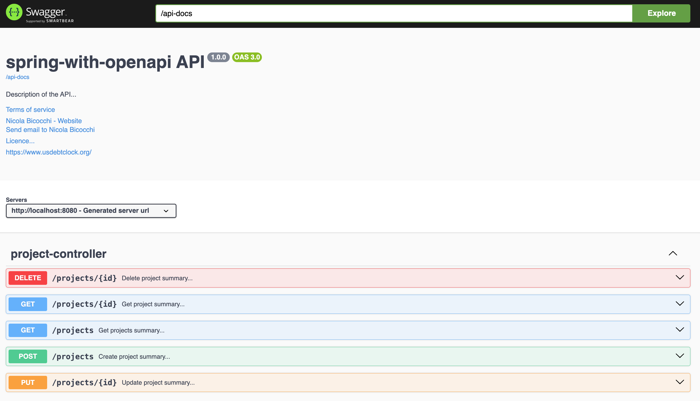

# Spring Boot with OpenAPI

In this lesson, we are going to learn about **the Spring Boot OpenAPI support**. The OpenAPI Specification is one of the most commonly used specifications when it comes to documenting RESTful services. Many of the leading API gateways have native support for the OpenAPI Specification.

With springdoc-openapi, you can create the API documentation on the fly at runtime by inspecting Java annotations in the code. If the API documentation is maintained in a separate life cycle from the Java source code, they will diverge from each other over time.

The relevant module for this lesson is: [spring-with-openapi-end](../code/learn-spring-m5/spring-with-openapi-end)


## OpenAPI dependencies
Spring Boot 3.x requires to use [version 2](https://github.com/springdoc/springdoc-openapi/releases/tag/v2.1.0) of [springdoc-openapi](https://central.sonatype.com/search?q=springdoc-openapi-starter-webmvc-ui):

```xml
<dependency>
    <groupId>org.springdoc</groupId>
    <artifactId>springdoc-openapi-starter-webmvc-ui</artifactId>
    <version>2.3.0</version>
</dependency>
```

We can also enable the _springdoc-openapi_ on a Spring WebFlux application. To enable this, we add the [_springdoc-openapi-webflux-ui_](https://central.sonatype.com/search?q=springdoc-openapi-starter-webflux-ui) dependency inside our _pom.xml_ file:

```xml
<dependency>
    <groupId>org.springdoc</groupId>
    <artifactId>springdoc-openapi-starter-webflux-ui</artifactId>
    <version>2.3.0</version>
</dependency>
```

## OpenAPI Configuration

First, we need to define a Spring bean that returns an OpenAPI bean. The source code looks like this:

```
@Bean
public OpenAPI getOpenApiDocumentation() {
    return new OpenAPI()
            .info(new Info().title(apiTitle)
                    .description(apiDescription)
                    .version(apiVersion)
                    .contact(new Contact()
                            .name(apiContactName)
                            .url(apiContactUrl)
                            .email(apiContactEmail))
                    .termsOfService(apiTermsOfService)
                    .license(new License()
                            .name(apiLicense)
                            .url(apiLicenseUrl)))
            .externalDocs(new ExternalDocumentation()
                    .description(apiExternalDocDesc)
                    .url(apiExternalDocUrl));
}
```

From the preceding code, we can see that the configuration contains general descriptive information about the API, such as: the name, description, version, contact information for the API etc...

The api variables that are used to configure the OpenAPI bean are initialized from the property file using Spring @Value annotations. These are as follows:

```
@Configuration
public class OpenAPIConfig {
    @Value("${api.common.version}")         String apiVersion;
    @Value("${api.common.title}")           String apiTitle;
    @Value("${api.common.description}")     String apiDescription;
    @Value("${api.common.termsOfService}")  String apiTermsOfService;
    @Value("${api.common.license}")         String apiLicense;
    @Value("${api.common.licenseUrl}")      String apiLicenseUrl;
    @Value("${api.common.externalDocDesc}") String apiExternalDocDesc;
    @Value("${api.common.externalDocUrl}")  String apiExternalDocUrl;
    @Value("${api.common.contact.name}")    String apiContactName;
    @Value("${api.common.contact.url}")     String apiContactUrl;
    @Value("${api.common.contact.email}")   String apiContactEmail;
    ...
}
```

The actual values are set in the property file, application.yml, as follows:

```
api:
  common:
    version: 1.0.0
    title: spring-with-openapi API
    description: Description of the API...
    termsOfService: Terms of Service...
    license: Licence...
    licenseUrl: https://www.usdebtclock.org/
    externalDocDesc: https://www.usdebtclock.org/
    externalDocUrl: https://www.usdebtclock.org/
    contact:
      name: Nicola Bicocchi
      url: https://www.usdebtclock.org/
      email: contact@mail.com
```


## OpenAPI Description Path

We can specify the path in _application.yml_ using the _springdoc.api-docs_ property. For example, we can set the path to _/api-docs_:

```
springdoc:
  api-docs.path: /api-docs
```

Then, we’ll be able to access the docs at: [_http://localhost:8080/api-docs_](http://localhost:8080/api-docs)

The OpenAPI definitions are in JSON format by default. For _yaml_ format, we can obtain the definitions at: [http://localhost:8080/api-docs.yaml](http://localhost:8080/api-docs.yaml)

Besides generating the OpenAPI 3 specification, we can integrate _springdoc-openapi_ with Swagger UI to interact with our API specification and exercise the endpoints.

**The _springdoc-openapi_ dependency already includes Swagger UI**. We can customize the path of our API documentation by changing the _springdoc.swagger-ui.path_ property inside our _application.yml_ file:

```
springdoc:
  swagger-ui:
    path: /swagger-ui.html
    operationsSorter: method
```

So now our API documentation will be available at [_http://localhost:8080/swagger-ui.html_](http://localhost:8080/swagger-ui.html).

As another example, we can sort the API paths according to their HTTP methods with the _springdoc.swagger-ui.operationsSorter_ property. It can be _alpha_ (sort by paths alphanumerically), _method_ (sort by HTTP method) or a function (see Array.prototype.sort() to know how sort function works). Default is the order returned by the server unchanged.

## Example API
Our application has a controller for managing _Projects_. We can use the following notation to introduce a summary and a description for each method:

```
@Operation(
        summary = "${variable defined in application.yml}",
        description = "${variable defined in application.yml}"
)
```

```
@RestController
@RequestMapping(value = "/projects")
public class ProjectController {

    private final IProjectService projectService;
    private final ProjectMapper mapper;

    public ProjectController(IProjectService projectService, ProjectMapper mapper) {
        this.projectService = projectService;
        this.mapper = mapper;
    }

    @Operation(
            summary = "${api.project.get-project.summary}",
            description = "${api.project.get-project.description}"
    )
    @GetMapping(value = "/{id}")
    public ProjectDto findOne(@PathVariable Long id) {
        Project entity = projectService.findById(id).orElseThrow(() -> new ResponseStatusException(HttpStatus.NOT_FOUND));
        return mapper.projectToProjectDTO(entity);
    }

    @Operation(
            summary = "${api.project.create-project.summary}",
            description = "${api.project.create-project.description}"
    )
    @PostMapping
    @ResponseStatus(HttpStatus.CREATED)
    public ProjectDto create(@RequestBody ProjectDto newProject) {
        // this is needed for testing purposes
        // see @Valid for industrial-grade validation
        if (newProject.name() == null) {
            throw new ResponseStatusException(HttpStatus.BAD_REQUEST);
        }
        Project entity = mapper.projectDTOToProject(newProject);
        return mapper.projectToProjectDTO(projectService.save(entity));
    }

    @Operation(
            summary = "${api.project.get-projects.summary}",
            description = "${api.project.get-projects.description}"
    )
    @GetMapping
    public Collection<ProjectDto> findAll() {
        Iterable<Project> allProjects = this.projectService.findAll();
        List<ProjectDto> projectDtos = new ArrayList<>();
        allProjects.forEach(p -> projectDtos.add(mapper.projectToProjectDTO(p)));
        return projectDtos;
    }

    @Operation(
            summary = "${api.project.update-project.summary}",
            description = "${api.project.update-project.description}"
    )
    @PutMapping("/{id}")
    public ProjectDto updateProject(@PathVariable("id") Long id, @RequestBody ProjectDto updatedProject) {
        Project entity = mapper.projectDTOToProject(updatedProject);
        return mapper.projectToProjectDTO(projectService.save(entity));
    }

    @Operation(
            summary = "${api.project.delete-project.summary}",
            description = "${api.project.delete-project.description}"
    )
    @DeleteMapping("/{id}")
    @ResponseStatus(HttpStatus.NO_CONTENT)
    public void deleteProject(@PathVariable("id") Long id) {
        projectService.deleteById(id);
    }
}
```

To avoid introducing summaries and descriptions directly into the source code we can make use of variables defined within _application.yml_ as reported below:

```
api:
  common:
    ...
  project:
    get-project:
      summary: "Get project summary..."
      description: "Get project..."
    get-projects:
      summary: "Get projects summary..."
      description: "Get projects..."
    create-project:
      summary: "Create project summary..."
      description: "Create project..."
    update-project:
      summary: "Update project summary..."
      description: "Update project..."
    delete-project:
      summary: "Delete project summary..."
      description: "Delete project..."
```

Then, when we run our application, we can view the documentation at: [_http://localhost:8080/swagger-ui.html_](http://localhost:8080/swagger-ui.html).



## Resources
- [Documenting a Spring REST API Using OpenAPI 3.0](https://www.baeldung.com/spring-rest-openapi-documentation)