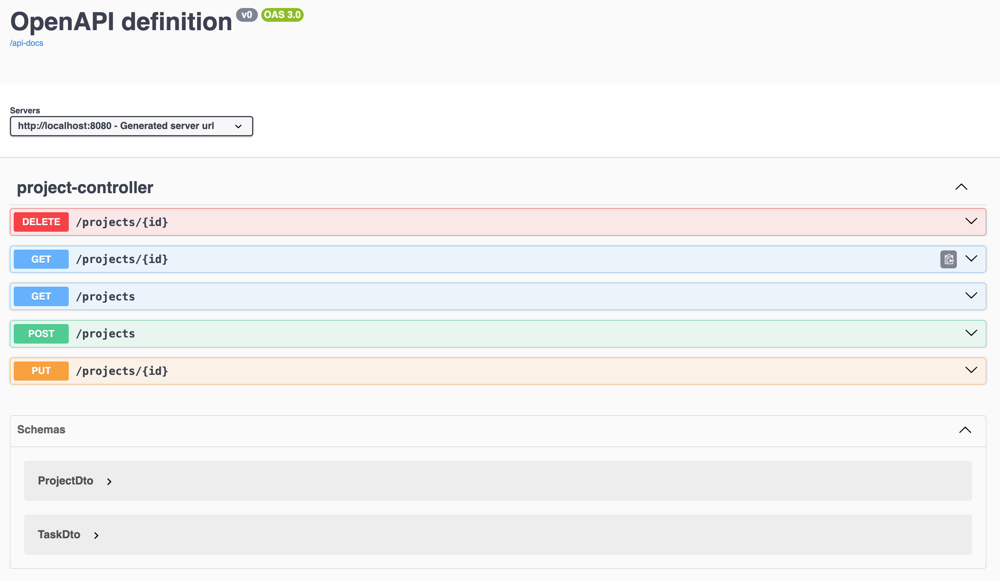

# Spring Boot with OpenAPI

In this lesson, we are going to learn about **the Spring Boot OpenAPI support**.

SpringDoc simplifies the generation and maintenance of API docs based on the OpenAPI 3 specification for Spring Boot 3.x applications.

The relevant module for this lesson is: [spring-with-openapi-end](../code/learn-spring-m6/spring-with-openapi-end)


## Setting up springdoc-openapi

Spring Boot 3.x requires to use [version 2](https://github.com/springdoc/springdoc-openapi/releases/tag/v2.1.0) of [springdoc-openapi](https://central.sonatype.com/search?q=springdoc-openapi-starter-webmvc-ui):

```
<dependency>
    <groupId>org.springdoc</groupId>
    <artifactId>springdoc-openapi-starter-webmvc-ui</artifactId>
    <version>2.3.0</version>
</dependency>
```

### OpenAPI Description Path

After setting up the dependency correctly, we can run our application and find the OpenAPI descriptions at _/v3/api-docs_, which is the default path:

```
http://localhost:8080/v3/api-docs
```

Further, we can customize the path in _application.properties_ using the _springdoc.api-docs_ property. For example, we can set the path to _/api-docs_:

```
springdoc.api-docs.path=/api-docs
```

Then, we’ll be able to access the docs at:

```
http://localhost:8080/api-docs
```

The OpenAPI definitions are in JSON format by default. For _yaml_ format, we can obtain the definitions at:

```
http://localhost:8080/api-docs.yaml
```

## Integration with Swagger UI

Besides generating the OpenAPI 3 specification, we can integrate _springdoc-openapi_ with Swagger UI to interact with our API specification and exercise the endpoints.

**The _springdoc-openapi_ dependency already includes Swagger UI**, so we’re all set to access the API documentation at:

```
http://localhost:8080/swagger-ui/index.html
```

### Support for _swagger-ui_ Properties

The springdoc-openapi library also supports [_swagger-ui_ properties](https://springdoc.org/#swagger-ui-properties). These can be used as Spring Boot properties with the prefix _springdoc.swagger-ui_.

For example, we can customize the path of our API documentation by changing the _springdoc.swagger-ui.path_ property inside our _application.properties_ file:

```
springdoc.swagger-ui.path=/swagger-ui-custom.html
```

So now our API documentation will be available at [_http://localhost:8080/swagger-ui-custom.html_](http://localhost:8080/swagger-ui-custom.html).

As another example, we can sort the API paths according to their HTTP methods with the _springdoc.swagger-ui.operationsSorter_ property:

```
springdoc.swagger-ui.operationsSorter=method
```

### Sample API

Our application has a controller for managing _Project_s:

```
@RestController
@RequestMapping(value = "/projects")
public class ProjectController {

    ...

    @GetMapping(value = "/{id}")
    public ProjectDto findOne(@PathVariable Long id) {
        Project entity = projectService.findById(id).orElseThrow(() -> new ResponseStatusException(HttpStatus.NOT_FOUND));
        return mapper.projectToProjectDTO(entity);
    }

    @PostMapping
    @ResponseStatus(HttpStatus.CREATED)
    public ProjectDto create(@RequestBody ProjectDto newProject) {
        // this is needed for testing purposes
        // see @Valid for industrial-grade validation
        if (newProject.name() == null) {
            throw new ResponseStatusException(HttpStatus.BAD_REQUEST);
        }
        Project entity = mapper.projectDTOToProject(newProject);
        return mapper.projectToProjectDTO(projectService.save(entity));
    }

    @GetMapping
    public Collection<ProjectDto> findAll() {
        Iterable<Project> allProjects = this.projectService.findAll();
        List<ProjectDto> projectDtos = new ArrayList<>();
        allProjects.forEach(p -> projectDtos.add(mapper.projectToProjectDTO(p)));
        return projectDtos;
    }

    @PutMapping("/{id}")
    public ProjectDto updateProject(@PathVariable("id") Long id, @RequestBody ProjectDto updatedProject) {
        Project entity = mapper.projectDTOToProject(updatedProject);
        return mapper.projectToProjectDTO(projectService.save(entity));
    }

    @DeleteMapping("/{id}")
    @ResponseStatus(HttpStatus.NO_CONTENT)
    public void deleteProject(@PathVariable("id") Long id) {
        projectService.deleteById(id);
    }
}
```

Then, when we run our application, we can view the documentation at:

```
http://localhost:8080/swagger-ui-custom.html
```



## Integrating springdoc-openapi With Spring WebFlux

We can also enable the _springdoc.swagger-ui_ properties on a Spring WebFlux application. This allows easy integration between springdoc-openapi and Swagger UI on our Spring WebFlux application. To enable this, we add the [_springdoc-openapi-webflux-ui_](https://central.sonatype.com/search?q=springdoc-openapi-starter-webflux-ui) dependency inside our _pom.xml_ file:

```xml
<dependency>
    <groupId>org.springdoc</groupId>
    <artifactId>springdoc-openapi-starter-webflux-ui</artifactId>
    <version>2.3.0</version>
</dependency>
```


## Using springdoc-openapi Maven Plugin

The springdoc-openapi library provides a Maven plugin, [_springdoc-openapi-maven-plugin_](https://mvnrepository.com/artifact/org.springdoc/springdoc-openapi-maven-plugin), which generates OpenAPI descriptions in JSON and YAML formats.

The _springdoc-openapi-maven-plugin_ plugin works with the _spring-boot-maven_ plugin. Maven runs the _openapi_ plugin during the _integration-test_ phase.

Let’s see how we can configure the plugin in our _pom.xml_:

```
<plugin>
    <groupId>org.springframework.boot</groupId>
    <artifactId>spring-boot-maven-plugin</artifactId>
    <version>2.3.3.RELEASE</version>
    <executions>
        <execution>
            <id>pre-integration-test</id>
            <goals>
                <goal>start</goal>
            </goals>
        </execution>
        <execution>
            <id>post-integration-test</id>
            <goals>
                <goal>stop</goal>
            </goals>
        </execution>
    </executions>
</plugin>
<plugin>
    <groupId>org.springdoc</groupId>
    <artifactId>springdoc-openapi-maven-plugin</artifactId>
    <version>1.4</version>
    <executions>
        <execution>
            <phase>integration-test</phase>
            <goals>
                <goal>generate</goal>
            </goals>
        </execution>
    </executions>
</plugin>
```

We can also configure the plugin to use custom values:

```xml
<plugin>
    <executions>
        .........
    </executions>
    <configuration>
        <apiDocsUrl>http://localhost:8080/v3/api-docs</apiDocsUrl>
        <outputFileName>openapi.json</outputFileName>
        <outputDir>${project.build.directory}</outputDir>
    </configuration>
</plugin>
```

Let’s take a closer look at the parameters that we can configure for the plugin:

- _apiDocsUrl_ – URL where the docs can be accessed in JSON format, with a default of _http://localhost:8080/v3/api-docs_
- _outputFileName_ – Name of the file where the definitions are stored; defaults to _openapi.json_
- _outputDir_ – Absolute path for the directory where the docs are stored; by default, it’s _${project.build.directory}_


## Resources
- [Documenting a Spring REST API Using OpenAPI 3.0](https://www.baeldung.com/spring-rest-openapi-documentation)