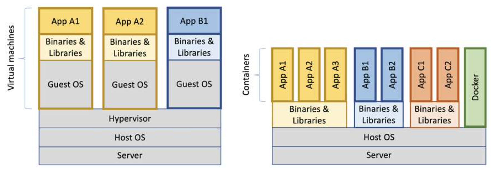

# Spring Boot with Docker

In this lesson, we are going to learn about **the Spring Boot Docker support**.

Note that we won’t be covering what Docker is nor its basic concepts here. If you don’t have experience using this platform, then I strongly recommend having a look at the Docker links in the Resources section before moving on, as they will help you understand all the base Docker features.

The relevant module for this lesson is: [spring-with-docker-end](../code/learn-spring-m6/spring-with-docker-end)

## Introduction to Docker
Docker made the concept of containers as a lightweight alternative to virtual machines very popular in 2013. Containers are processed in a Linux host that uses Linux namespaces to provide isolation between containers, and Linux Control Groups (cgroups) are used to limit the amount of CPU and memory that a container is allowed to consume.

Compared to a virtual machine that uses a hypervisor to run a complete copy of an operating system in each virtual machine, the overhead in a container is a fraction of the overhead in a virtual machine. This leads to much faster startup times and a significantly lower footprint. Containers are, however, not considered to be as secure as virtual machines. Take a look at the following diagram:



The diagram illustrates the difference between the resource usage of virtual machines and containers, demonstrating that the same type of server can run significantly more containers than virtual machines. The main gain is that a container doesn’t need to run its own instance of an operating system as a virtual machine does.

### First Docker commands
Let’s try to start a container by launching an Ubuntu server using Docker’s run command: 

```
$ docker run -it --rm ubuntu
```

With the preceding command, we ask Docker to create a container that runs Ubuntu, based on the latest version that’s available. The -it option is used so that we can interact with the container using Terminal, and the --rm option tells Docker to remove the container once we exit the Terminal session.

The first time we use a Docker image that we haven’t built ourselves, Docker will download it from a Docker registry, which is Docker Hub by default (https://hub.docker.com). This will take some time, but for subsequent usage of that Docker image, the container will start in just a few seconds!

Once the Docker image has been downloaded and the container has been started up, the Ubuntu server should respond with a prompt such as the following:

```
$ docker run -it --rm ubuntu
root@a48641193673:/#
```

We can try out the container by, for example, asking what version of Ubuntu it runs:

```
# cat /etc/os-release | grep 'VERSION='
VERSION="22.04.3 LTS (Jammy Jellyfish)"
```

### Running Java in Docker
Over the past few years, there have been a number of attempts to get Java working in Docker in a good way. Most importantly, Java hasn’t historically been very good at respecting limits set for Docker containers when it comes to the use of memory and CPU.

Instead of allocating memory inside the JVM in relation to the memory available in the container, Java allocated memory as if it had access to all the memory in the Docker host. When trying to allocate more memory than allowed, the Java container was killed by the host with an “out of memory” error message. In the same way, Java allocated CPU-related resources such as thread pools in relation to the total number of available CPU cores in the Docker host, instead of the number of CPU cores that were made available for the container JVM was running in.

In Java SE 9, initial support for container-based CPU and memory constraints was provided, much improved in Java SE 10.

Let’s look at how Java SE 17 responds to limits we set on a container it runs in!

```
# opens jshell inside the JVM containers
$ docker run -i --rm eclipse-temurin:17
```

### Limiting CPUs

This command will send the string Runtime.getRuntime().availableProcessors() to the Docker container, which will process the string using jshell:

```
echo 'Runtime.getRuntime().availableProcessors()' | docker run --rm -i eclipse-temurin:17
Jan 15, 2024 3:45:43 PM java.util.prefs.FileSystemPreferences$1 run
INFO: Created user preferences directory.
|  Welcome to JShell -- Version 17.0.8.1
|  For an introduction type: /help intro

jshell> Runtime.getRuntime().availableProcessors()$1 ==> 8
```

Let’s move on and restrict the Docker container to only be allowed to use three CPU cores using the --cpus option, then ask the JVM about how many available processors it sees:

```
echo 'Runtime.getRuntime().availableProcessors()' | docker run --rm --cpus=2 -i eclipse-temurin:17
Jan 15, 2024 3:47:20 PM java.util.prefs.FileSystemPreferences$1 run
INFO: Created user preferences directory.
|  Welcome to JShell -- Version 17.0.8.1
|  For an introduction type: /help intro

jshell> Runtime.getRuntime().availableProcessors()$1 ==> 2
```

The JVM now responds with 2; that is, Java SE 17 honors the settings in the container and will, therefore, be able to configure CPU-related resources such as thread pools correctly!

### Limiting memory

In terms of the amount of available memory, let’s ask the JVM for the maximum size that it thinks it can allocate for the heap:

```
$ docker run -it --rm eclipse-temurin:17 java -XX:+PrintFlagsFinal | grep "size_t MaxHeapSize"
size_t MaxHeapSize = 2061500416                                {product} {ergonomic}
```

With no JVM memory constraints (that is, not using the JVM parameter -Xmx), Java will allocate one-quarter of the memory available to the container for its heap (in this case about 2GB).

If we constrain the Docker container to only use up to 1 GB of memory using the Docker option -m=1024M, we expect to see a lower max memory allocation.

```
$ docker run -it --rm -m=1024M eclipse-temurin:17 java -XX:+PrintFlagsFinal | grep "size_t MaxHeapSize"
size_t MaxHeapSize = 268435456                                 {product} {ergonomic}
```

Approximately 256MB is one-quarter of 1 GB, so again, this is as expected.

We can also set the max heap size on the JVM ourselves. For example, if we want to allow the
JVM to use 600 MB of the total 1 GB we have for its heap, we can specify that using the JVM option -Xmx600m like so:

```
$ docker run -it --rm -m=1024M eclipse-temurin:17 java -Xmx600m -XX:+PrintFlagsFinal -version | grep "size_t MaxHeapSize"
size_t MaxHeapSize = 629145600                                 {product} {ergonomic}
```

Let’s conclude with an “out of memory” test to ensure that this really works!
We’ll allocate 10MB of memory using jshell in a JVM that runs in a container that has been given 256MB of memory; that is, it has a max heap size of 64MB.

```
echo "new byte[10_000_000]" | docker run -i --rm -m=256M eclipse-temurin:17
Jan 15, 2024 4:03:08 PM java.util.prefs.FileSystemPreferences$1 run
INFO: Created user preferences directory.
|  Welcome to JShell -- Version 17.0.8.1
|  For an introduction type: /help intro

...

jshell> % 
```

This works fine. Let's move from 10MB to 100MB!

```
echo "new byte[100_000_000]" | docker run -i --rm -m=256M eclipse-temurin:17
Jan 15, 2024 4:03:50 PM java.util.prefs.FileSystemPreferences$1 run
INFO: Created user preferences directory.
|  Welcome to JShell -- Version 17.0.8.1
|  For an introduction type: /help intro

jshell> new byte[100_000_000]|  Exception java.lang.OutOfMemoryError: Java heap space
|        at (#1:1)

jshell> %  
```

The JVM sees that it can’t perform the action since it honors the container settings of max memory and responds immediately with Exception java.lang.OutOfMemoryError: Java heap space. Great!

## Building an Image with the Spring Boot Plugin

If you have some experience with Docker, you know we can use a Dockerfile to build our Spring Boot application into a Docker image.

To do this efficiently, **we would have to split our application's jar and indicate which parts of the application will go into each image layer** for Docker to cache them properly, aiming to have less frequently changing layers above more frequently changing layers.

We can do this manually but depending on the size of the project it can get hard to maintain.

So to make this easier for us, Spring Boot added some features to **the Spring Boot Plugin on version 2.3 that help us with the process of building our application into a Docker image:**

-   layertools, to help us inspect and extract the layers in our jar
-   integration with Cloud Native Buildpacks, which help us build the actual Open Container Initiative (OCI) image

### Building an Image From the Command Line

Before we start, please note that to build an image Docker must be installed in your system locally.

We'll be using our simple Projects REST service to package the application as a Docker image using the Spring Boot Maven plugin.

Note: make sure to run _mvn clean install_ first to download the plugin.

We can do this in two ways. **The first method is using the _spring-boot:build-image_ plugin goal directly in the terminal:**

```
$ mvn spring-boot:build-image
```

**We can use this if we only want to build the image quickly without modifying anything in our project configuration.**

If we explore the log entries we'll be able to see that the task is executed as expected:

```
[INFO] ----------------< com.baeldung:spring-with-docker-end >-----------------
[INFO] Building spring-with-docker-end 0.1.0-SNAPSHOT
[INFO]   from pom.xml
[INFO] --------------------------------[ jar ]---------------------------------
```

As you can see, now the image is being built using the artifact id as the name (_spring-boot-with-docker_) and tagged with the corresponding artifact version (_0.1.0-SNAPSHOT_).

After the build is done, we can list our Docker images in the terminal to verify the images have been created as expected:

```
$ docker images
...
com.baeldung/spring-with-docker-end          0.1.0-SNAPSHOT   d153ef79b3c5   44 years ago    388MB
...
```

Now let’s run our image. We will name the container _project-api_ and bind the port 8080 in the container to 8080 in our host machine:

```
$ docker run --name spring-with-docker-end -p 8080:8080 com.baeldung/spring-with-docker-end:0.1.0-SNAPSHOT
```

This is what we can infer from the command:
* docker run: The docker run command will start the container and display log output in the Terminal. The Terminal will be locked as long as the container runs.
* The --name option assigns to the _container_ the name specified. Without using this option, the container will be assigned with a random name.
* The -p 8080:8080 option maps port 8080 in the container to port 8080 in the Docker host, which makes it possible to call it from the outside. In the case of Docker Desktop for Mac, which runs Docker in a local Linux virtual machine, the port will also be port-forwarded to macOS, which is made available on localhost. Remember that we can only have one container mapping to a specific port in the Docker host!

Now let's list our running containers:

```
$ docker ps

CONTAINER ID   IMAGE                                                COMMAND              CREATED         STATUS         PORTS                    NAMES
5214b025053f   com.baeldung/spring-with-docker-end:0.1.0-SNAPSHOT   "/cnb/process/web"   9 seconds ago   Up 8 seconds   0.0.0.0:8080->8080/tcp   spring-with-docker-end
```

And check the application logs:

```
$ docker logs spring-with-docker-end
```

Let's verify that there are no errors, and let’s hit our endpoint:

[http://localhost:8080/projects](http://localhost:8080/projects)

Let's go a little bit further. With the -e option, we can specify environment variables for the container, which, in this case, is SPRING_PROFILES_ACTIVE=docker. The SPRING_PROFILES_ACTIVE environment variable is used to tell Spring what profiles to use. In our case, we want Spring to use the docker profile.

```
$ docker run -p 8080:8080 -e "SPRING_PROFILES_ACTIVE=docker" com.baeldung/spring-with-docker:0.1.0-SNAPSHOT

2024-01-15T17:53:18.822Z  INFO 1 --- [           main] com.baeldung.ls.LsApp                    : Starting LsApp v0.1.0-SNAPSHOT using Java 21.0.1 with PID 1 (/workspace/BOOT-INF/classes started by cnb in /workspace)
2024-01-15T17:53:18.828Z  INFO 1 --- [           main] com.baeldung.ls.LsApp                    : The following 1 profile is active: "docker"
2024-01-15T17:53:19.909Z  INFO 1 --- [           main] .s.d.r.c.RepositoryConfigurationDelegate : Bootstrapping Spring Data JPA repositories in DEFAULT mode.
2024-01-15T17:53:20.011Z  INFO 1 --- [           main] .s.d.r.c.RepositoryConfigurationDelegate : Finished Spring Data repository scanning in 90 ms. Found 2 JPA repository interfaces.
2024-01-15T17:53:20.762Z  INFO 1 --- [           main] o.s.b.w.embedded.tomcat.TomcatWebServer  : Tomcat initialized with port 7777 (http)
...
```

As you can see a different profile (**docker** in this case) is activated, leading to the use of a different _application.properties_ file. In this case the server port is changed to 7777. This is greatly useful when deploying microservices in production for adapting the whole configuration using a single environment variable.

### Building an Image as Part of the Artifact Build Process

We can of course **add the execution of this particular _spring-boot:build-image_ goal to the _spring-boot-maven-plugin_** setup so as to build the image each time we build the project artifact:

```
<build>
    <plugins>
        <plugin>
            <groupId>org.springframework.boot</groupId>
            <artifactId>spring-boot-maven-plugin</artifactId>
            <configuration>
                <image>
                    <name>com.baeldung/spring-with-docker-end:${project.version}</name>
                </image>
            </configuration>
            <executions>
                <execution>
                    <goals>
                        <goal>build-image</goal>
                    </goals>
                </execution>
            </executions>
        </plugin>
    </plugins>
</build>
```

**Here we are also indicating how the image should be named (_com.baeldung/project-api_) and we're using XML variables to set the appropriate version tag.**

Let’s build the image this time by triggering the Maven build process from the command line. All Spring Boot plugin executions are configured to run in the _package_ phase by default, so adding the _build-image_ to the executions will run this goal automatically in this same phase:

```
$ mvn package
```

**This will now package our application into a JAR file and build the Docker image as well.**

## Building an Image with Jib Plugin

_Jib_ is an open-source Java tool maintained by Google for building Docker images of Java applications. It simplifies containerization since with it, **we don’t need to write a _dockerfile._** And actually, **we don’t even have to have _docker_ installed** to create and publish the docker images ourselves.

Google publishes Jib as both a Maven and a Gradle plugin. This is nice because it means that Jib will catch any changes we make to our application each time we build. **This saves us separate docker build/push commands and simplifies adding this to a CI pipeline.**

```xml
<project>
    ...
    <build>
        <plugins>
            ...
            <plugin>
                <groupId>com.google.cloud.tools</groupId>
                <artifactId>jib-maven-plugin</artifactId>
                <version>3.4.0</version>
                <configuration>
                    <to>
                        <image>com.baeldung/spring-with-docker-end-jib:${project.version}</image>
                    </to>
                </configuration>
            </plugin>
            ...
        </plugins>
    </build>
    ...
</project>
```

With this change, we can create images with:

```bash
# (pushes to DockerHub)
$ mvn compile jib:build 
```

```bash
# (pushes to local docker daemon)
$ mvn compile jib:dockerBuild
```

We can list our Docker images in the terminal to verify the images have been created as expected:

```
$ docker images
...
com.baeldung/spring-with-docker-end          0.1.0-SNAPSHOT   d153ef79b3c5   44 years ago    388MB
com.baeldung/spring-with-docker-end-jib      0.1.0-SNAPSHOT   af090b82786b   54 years ago    315MB
...
```

_Jib_ created a smaller image in a much shorter time!


### Customizing Docker Aspects

By default, **Jib makes a number of reasonable guesses about what we want**, like the FROM and the ENTRYPOINT.

Let’s make a couple of changes to our application that are more specific to our needs.

First, Spring Boot exposes port 8080 by default.

But, let’s say, we want to make our application run on port 8082 and make it exposable through a container.

Of course, we’ll make the appropriate changes in Boot. And, after that, we can use Jib to make it exposable in the image:

```xml
<configuration>
    ...
    <container>
        <ports>
            <port>8082</port>
        </ports>
    </container>
</configuration>
```

Or, let’s say we need a different FROM. **By default, Jib uses the [distro-less java image](https://github.com/GoogleContainerTools/distroless/tree/master/java)**. If we want to run our application on a different base image, like [alpine-java](https://hub.docker.com/r/anapsix/alpine-java/), we can configure it in a similar way:

```xml
<configuration>
    ...
    <from>
        <image>openjdk:alpine</image>
    </from>
    ...
</configuration>
```

We configure tags, volumes, and [several other Docker directives](https://github.com/GoogleContainerTools/jib/tree/master/jib-maven-plugin#extended-usage) in the same way.

### Customizing Java Aspects

And, by association, Jib supports numerous Java runtime configurations, too:

-   _jvmFlags_ is for indicating what startup flags to pass to the JVM.
-   _mainClass_ is for indicating the main class, which **Jib will attempt to infer automatically by default.**
-   _args_ is where we’d specify the program arguments passed to the _main_ method.

Of course, make sure to check out Jib’s documentation to see all the [configuration properties available](https://github.com/GoogleContainerTools/jib/tree/master/jib-maven-plugin).


## Building an Image with Docker

### Single-Layer Jars

Although it’s always been possible to convert the fat jars produced by Spring Boot into Docker images, it’s pretty easy to make less than optimal results. If you do a web search for "dockerize spring boot app", the chances are high you’ll find an article or blog post suggesting you create a dockerfile that looks something like this:

```
FROM eclipse-temurin:17.0.5_8-jre-focal
ARG JAR_FILE=target/*.jar
COPY ${JAR_FILE} application.jar
ENTRYPOINT ["java", "-jar", "/application.jar"]
```

Whilst this approach works fine, and it’s nice and concise, there are a few things that are sub-optimal.

The first problem with above file is that the jar file is not unpacked. There’s always a certain amount of overhead when running a fat jar, and in a containerized environment this can be noticeable. It’s generally best to unpack your jar and run in an exploded form.

The second issue with the file is that it isn’t very efficient if you frequently update your application. Docker images are built in layers, and in this case your application and all its dependencies are put into a single layer. Since you probably recompile your code more often than you upgrade the version of Spring Boot you use, it’s often better to separate things a bit more. If you put jar files in the layer before your application classes, Docker often only needs to change the very bottom layer and can pick others up from its cache.

### Multi-Layer Jars

**A Docker image is made up of layers. Each layer represents a certain instruction written in a Dockerfile.** This layered approach is useful because layers from one image can be reused in other images.

The Spring Boot team has made it easier to split our application into sensible layers to adapt efficiently to this approach. Since version 2.4.0, **this feature is enabled by default**, so there is nothing special we have to do in our project to obtain a layered jar.

For previous versions, however, we have to enable this configuration explicitly in our _spring-boot-maven-plugin_ setup:

```
<configuration>
    <layers>
        <enabled>true</enabled>
    </layers>
</configuration>
```

By default, Spring defines four layers after we package the JAR. **We can inspect these layers using the _layertools_ mechanism** added by the Spring team:

```
$ java -Djarmode=layertools -jar target/spring-with-docker-end-0.1.0-SNAPSHOT.jar list
dependencies
spring-boot-loader
snapshot-dependencies
application
```

The command lists these four layers:

-   _dependencies:_ contains all the application dependencies
-   _spring-boot-loader:_ contains the Spring Boot loader classes
-   _snapshot-dependencies:_ contains snapshot dependencies that might change more often than normal dependencies
-   _application:_ contains our code

The [official documentation](https://docs.spring.io/spring-boot/docs/current/reference/html/executable-jar.html#appendix.executable-jar) describes the internal structure of JAR files.

**We can use this same _layertools_ instrument to extract and make use of the layers when we build the Docker image.**

For instance, let's have a look at the Dockerfile included in this project:

```
FROM eclipse-temurin:17.0.5_8-jre-focal as builder
WORKDIR extracted
ARG JAR_FILE=target/*.jar
COPY ${JAR_FILE} application.jar
RUN java -Djarmode=layertools -jar application.jar extract

FROM eclipse-temurin:17.0.5_8-jre-focal
WORKDIR application
COPY --from=builder extracted/dependencies/ ./
COPY --from=builder extracted/spring-boot-loader/ ./
COPY --from=builder extracted/snapshot-dependencies/ ./
COPY --from=builder extracted/application/ ./

ENTRYPOINT ["java", "org.springframework.boot.loader.launch.JarLauncher"]
```

Let’s go through the main instructions. The first line indicates we’re using _openjdk_ as builder. We are using a feature in Docker called multi-stage builds, please note you can only do this in Docker v17+. Doing this will keep the size of our build down because we can make builders copy its content to other stages and then discard them on the final stage. As you can see, we’re using _layertools_ to extract the layers we just saw. Then we run our actual build accessing the extracted content in the next stage. Finally, we are using the Spring _JarLauncher_ to execute the Spring Boot application.

Let’s now build the image from the project root directory using the Docker CLI:

```
$ mvn clean package
$ docker build -f docker/Dockerfile . --tag com.baeldung/spring-with-docker-end-docker:0.1.0-SNAPSHOT

Step 8/12 : COPY --from=builder application/dependencies/ ./
 ---> Using cache
 ---> d65f759258a2
Step 9/12 : COPY --from=builder application/spring-boot-loader/ ./
 ---> Using cache
 ---> d96dc51846be
Step 10/12 : COPY --from=builder application/snapshot-dependencies/ ./
 ---> Using cache
 ---> 5b749d9b6d50
Step 11/12 : COPY --from=builder application/application/ ./
 ---> 948e098fa982
...
```

**If we change something in our application, repackage it and rebuild the image we'll be able to see the build is using the cached layers except for the application layer:**


```
$ docker images

com.baeldung/spring-with-docker-end          0.1.0-SNAPSHOT   d153ef79b3c5   44 years ago    388MB
com.baeldung/spring-with-docker-end-jib      0.1.0-SNAPSHOT   af090b82786b   54 years ago    315MB
com.baeldung/spring-with-docker-end-docker   0.1.0-SNAPSHOT   ef0655d8bee8   6 minutes ago   316MB
...
```

## Container Image Creation Best Practices
1.  Only include the files that are strictly necessary for your application. Don’t install packages, binaries, libraries, and any file your application doesn’t need, and keep image content as small as possible, exposing a minimal attack surface.
2.  Use the .dockerignore file to avoid passing unnecessary files from your build context to container runtimes.
3.  Prepare debugging versions of your images, including some binaries or tools that may help you resolve an issue, but never use these images in production.
4.  Prepare the logic of your Dockerfiles to accommodate your changes; hence, include your code close to the end of the file, and think about how many modules or dependencies may need to be changed to execute the updates in the proper section.
5.  Use layer caching whenever it is possible to speed up the build process and remember that using many layers will allow reusability but affect performance when files need runtime changes.
6.  Never use root in your applications unless it is strictly required. If you do, you should understand its risks and manage them. You can use the USER key multiple times to change the execution user during builds, but always finish your Dockerfile with a non-root user.
7.  Never include sensitive information, such as certificates, passwords, and tokens, in your final container images. This information should be provided at runtime. Use Docker’s buildx to include secrets only during the build process.
8.  Declare all your application requirements, such as your process user, the exposed ports, and the command line to be executed, in your Dockerfile. This will help other developers use your applications.
9.  Use labels to add information about your application’s life cycle, maintainer, special libraries that are required, and so on. This information will be great for other developers to help them understand how they can integrate their code into your images or evolve your Dockerfiles.
10.  Image size matters, especially if you are running your containerized applications in a distributed environment. Container runtimes must download images if a container must be created on a host. Depending on the number of changes you make to your images, this can be a challenge, and resilience in the face of application issues may be affected if your platform defines an always pull policy.

Some recommendations that may help your building process:
* Ordering layers is key to speeding up and maintaining application changes. Try to find the best logical order to declare your Dockerfile’s recipe. If we have some time-intensive tasks, such as installing a lot of software packages, it is preferable to make these changes at the beginning of the build process. Conversely, the files that we change more often, probably our application’s code, should be close to the end of the Dockerfile.
* This also works with the COPY key; if your application has a lot of dependencies, copying all your code and requirements at once can be problematic. It is better to split your files into different COPY sentences and copy your module requirements declaration files, then update these dependencies, and after that, copy the code for building. This ensures that all our code changes will not cause the dependencies to be downloaded again in the container-building process.
* It is good practice to keep layers as small as possible. We will try to use RUN, COPY, and ADD, executing as many changes as possible, although this may impact layer reusability. We will combine multiple RUN executions into one line. Fewer Dockerfile lines mean smaller caching, which is good, but you can’t reuse layers too often for new images. Any small variation between your Dockerfiles will invalidate caching from one Dockerfile to another.


## Resources
- [Docker Overview](https://docs.docker.com/get-started/overview/)
- [Docker - Getting Started guide](https://docs.docker.com/get-started/)
- [Creating Docker Images with Spring Boot](https://www.baeldung.com/spring-boot-docker-images)
- [Spring Boot Maven Plugin - Layered Jars](https://docs.spring.io/spring-boot/docs/current/maven-plugin/reference/htmlsingle/#repackage-layers)
